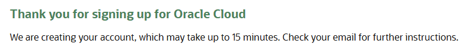

# Oracle Cloud — Setup Guide
Goal: create an always free Oracle Cloud VM suitable for hosting Audiobookshelf + Immich and prepare for Hetzner/remote object storage.

* Oracle Cloud Free Tier gives a Free Trial with US$300 credits for 30 days and a set of Always Free resources that do not expire. 
* Ampere (ARM) A1 instances available that are effectively 4 OCPUs + 24 GB RAM (useful to run media/photo processing). 
* Always Free block storage: 200 GB total (boot + block volumes combined). 
* Network: 10 TB per month outbound data transfer allowance (per originating region). 

Important: These limits and offerings are published by Oracle and may change always check Oracle’s official Free Tier page if in doubt. [Oracle Cloud Free Tier](https://www.oracle.com/cloud/free/)

## Table of Contents
1. [Account Prerequisites & Signup Notes](#account-prerequisites--signup-notes)
2. [Region & Tenancy Considerations (Region Lock Warning)](#region--tenancy-considerations-region-lock-warning)
3. [Create Virtual Machine](#create-virtual-machine)

## Account Prerequisites & Signup Notes
* Sign up at https://cloud.oracle.com and start the Free Trial / Free Tier signup. 
* Fill in the account information and the verify your email.
* Select 'Individual' Customer type and Germany Central (Frankfurt) as the home region
* Fill in address and mobile details
* Fill in credit/debit card detail. Remember there is no charge.
* Agree to start your free trial then wait
  

## Region & Tenancy Considerations (Region Lock Warning)
Choose a region near your storage for my situation as Hetzner is in Germany then Frankfurt is a good choice for low latency.

## Create Virtual Machine
* log into [Oracle Cloud](https://www.oracle.com/cloud/sign-in.html) 
